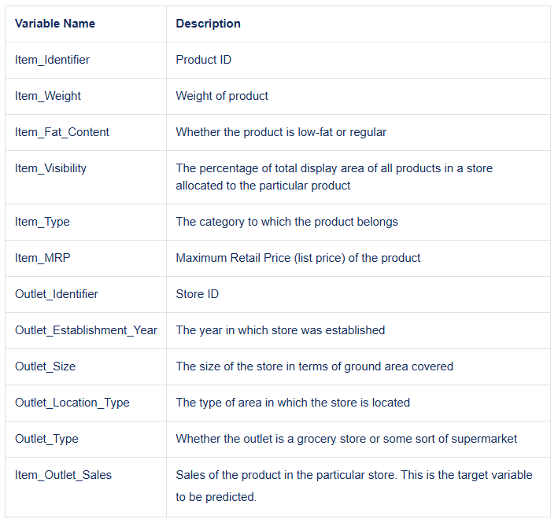
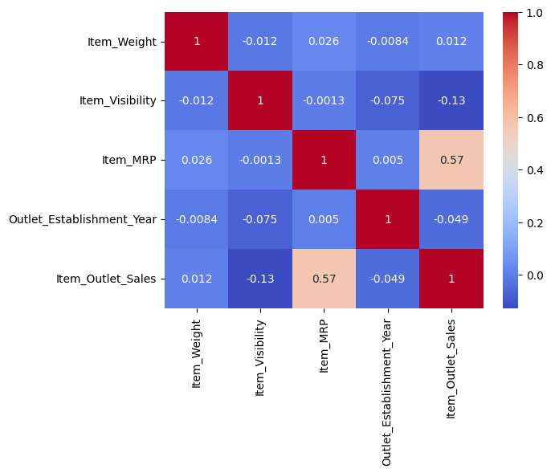
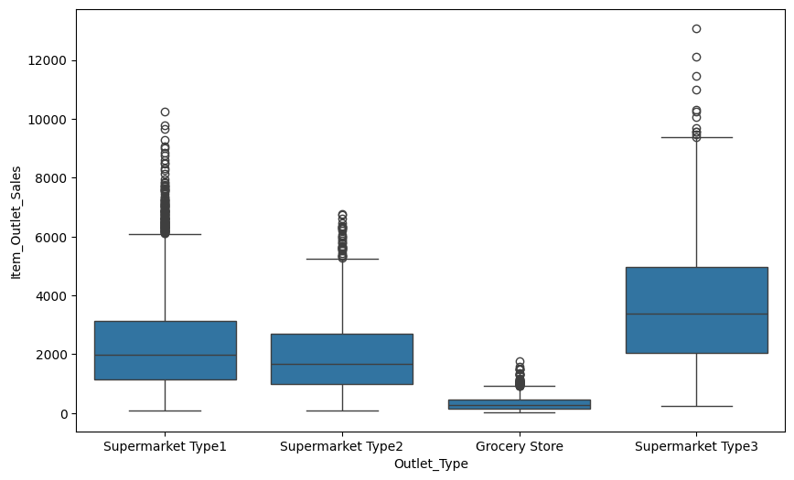

# Prediction-of-Product-Sales
This project explores and models sales data from retail stores to find what affects product sales the most. It uses real-world data from different outlets, item types, and prices.

# Working environmnt
**Platform:** Google Colab 

**Dataset Source:** [Kaggle Dataset Link](https://www.kaggle.com/datasets/ruchi798/data-science-job-salaries)

## Data Dictionary

This table explains what each column in the dataset means.

---

## Part 1: Load and Clean the Data

- Loaded the dataset using Pandas.
- Checked data types, missing values, and duplicates.
- Cleaned missing data and inconsistent categories.
- Summary statistics were gathered for numeric columns.

---
## Part 2: Data Exploration

We created several types of visualizations to better understand the data.

### Correlation Heatmap

`Item_MRP` (product price) has a strong positive relationship with sales — more expensive items tend to sell more.

### Sales by Outlet Type

`Supermarket Type3` has the highest median sales, showing outlet type influences how well products sell.

---
## Goal

The goal of this project is to explore real sales data, clean it properly, and understand what factors are most important for predicting sales. This is a foundational project to build strong data science skills.
